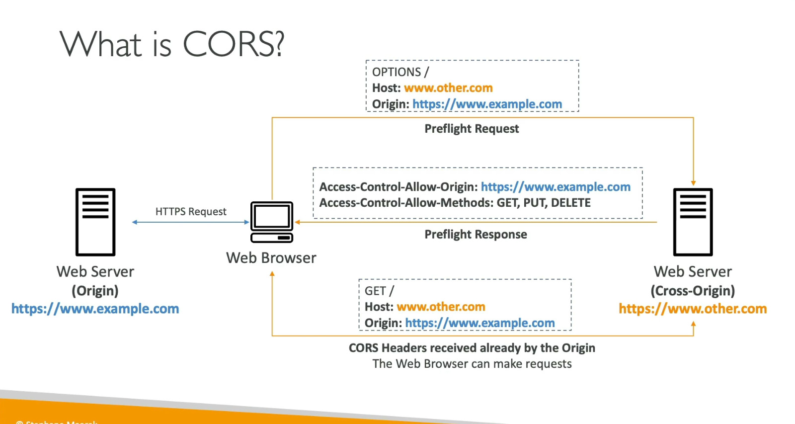

# Amazon S3 — CORS

- If a client makes a Cross-Origin request on our S3 bucket, we need to enable the correct CORS headers
- It's a popular exam question
- You can allow for a specific origin or for `*` (all origins)

## What is CORS?

- Cross-Origin Resource Sharing (CORS)
- Origin = scheme (protocol) + host (domain) + port
    * Example: https://www.example.com (implied port is 443 for HTTPS, 80 for HTTP)
- Web browser-based mechanism to allow requests to other origins while visiting the main origin
- Same origin: http://example.com/app1 & http://example.com/app2
- Different origins: http://www.example.com & http://other.example.com
- The request won't be fulfilled unless the other origin allows it, using CORS Headers (e.g. Access-Control-Allow-Origin)

## S3 CORS Scenario

- If a website hosted in Bucket A fetches resources from Bucket B, Bucket B must have a CORS configuration allowing requests from Bucket A's origin
- CORS is enforced by the browser — it does **not** apply to server-to-server communication (e.g. EC2 to S3 uses IAM Roles)

  
